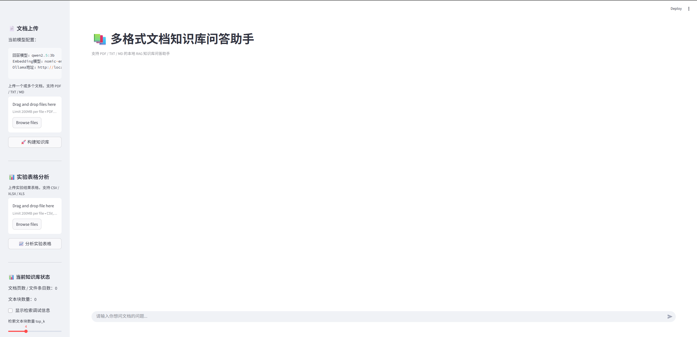
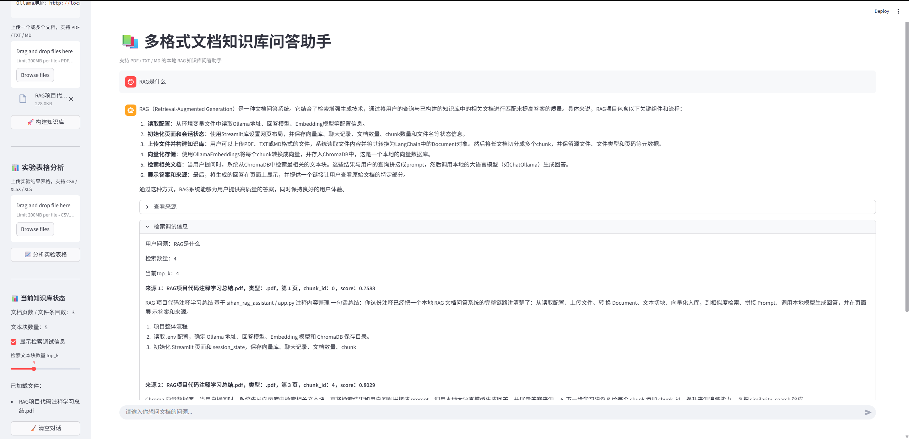
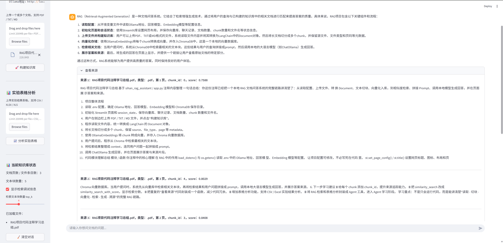

# 📚 AI Research Assistant

一个基于 **Streamlit + LangChain + ChromaDB + Ollama** 构建的本地 AI 研究助手。

本项目支持多格式文档上传、本地 RAG 知识库问答、来源追踪、检索调试、多轮追问，以及 CSV / Excel 实验结果表格分析。适合用于论文阅读、项目资料问答、实验结果分析和 AI 应用开发学习。

---

## ✨ 项目亮点

- 📄 支持 PDF / TXT / MD 多格式文档上传
- 🧩 自动将长文档切分为 chunk，便于向量检索
- 🧠 使用 Ollama 本地模型进行问答生成
- 🔍 使用 ChromaDB 构建本地向量知识库
- 📌 支持来源追踪：文件名、文件类型、页码、chunk_id
- 📊 支持检索分数 score 展示
- 🎚️ 支持 top_k 检索数量调节
- 🛠️ 支持检索调试信息展示
- 💬 支持多轮追问，能够结合最近聊天历史理解上下文
- 📈 支持 CSV / Excel 实验结果表格自动分析
- 🖥️ 全程本地运行，适合学习和个人研究使用

---

## 🖼️ 项目预览

### 文档上传与知识库构建



### RAG 文档问答



### 来源追踪与检索分数



### 检索调试信息


### 实验表格分析


---

## 🧱 技术栈

| 模块 | 技术 |
|---|---|
| Web UI | Streamlit |
| RAG 框架 | LangChain |
| 文档读取 | PyPDFLoader / TextLoader |
| 文本切分 | RecursiveCharacterTextSplitter |
| 向量数据库 | ChromaDB |
| 本地大模型 | Ollama + qwen2.5:3b |
| Embedding 模型 | nomic-embed-text |
| 表格分析 | pandas |
| 配置管理 | python-dotenv |

---

## 🚀 功能说明

### 1. 多格式文档上传

支持上传：

- PDF
- TXT
- MD / Markdown

上传后，系统会自动读取文档内容，并转换为 LangChain 的 `Document` 对象。

每个 `Document` 包含：

```python
Document(
    page_content="文档正文内容",
    metadata={
        "source": "文件名.pdf",
        "file_type": ".pdf",
        "page": 0
    }
)
```

---

### 2. 文档切分与 chunk_id 追踪

系统会使用 `RecursiveCharacterTextSplitter` 将长文档切成多个小文本块。

当前默认参数：

```python
chunk_size = 900
chunk_overlap = 150
```

每个 chunk 会被添加 `chunk_id`，方便后续追踪来源：

```python
chunk.metadata["chunk_id"] = i
```

这样在回答来源中可以看到：

```text
来源 1：paper.pdf，类型：.pdf，第 3 页，chunk_id：12
```

---

### 3. 本地向量库构建

系统使用 Ollama 的 embedding 模型将文本 chunk 转成向量，并存入 ChromaDB。

当前默认配置：

```env
OLLAMA_BASE_URL=http://localhost:11434
OLLAMA_MODEL=qwen2.5:3b
OLLAMA_EMBED_MODEL=nomic-embed-text
```

向量库默认保存位置：

```text
chroma_db/
```

每次重新构建知识库时，旧的 `chroma_db` 会被清理，避免新旧文档混在一起。

---

### 4. RAG 文档问答

用户提问后，系统会执行以下流程：

```text
用户问题
  ↓
转成 query embedding
  ↓
在 ChromaDB 中检索相关 chunk
  ↓
整理为 context
  ↓
拼接 prompt
  ↓
调用 qwen2.5:3b 生成回答
  ↓
显示答案和来源
```

系统会尽量只根据检索到的文档资料回答问题，并在资料不足时提示：

```text
根据当前资料无法确定
```

---

### 5. 检索分数 score 展示

项目使用：

```python
similarity_search_with_score()
```

检索时会同时返回：

```python
(Document, score)
```

因此可以在来源中展示：

```text
来源 1：paper.pdf，类型：.pdf，第 3 页，chunk_id：12，score：0.2187
```

注意：Chroma 返回的 `score` 在很多情况下更接近距离分数，通常可以理解为用于观察检索排序的参考值。

---

### 6. top_k 可调检索数量

侧边栏提供 `top_k` 滑块，可以控制每次检索返回多少个文本块。

```text
top_k = 1 ~ 10
```

适用场景：

| 场景 | 建议 top_k |
|---|---|
| 简单事实问答 | 2–3 |
| 普通文档问答 | 4–5 |
| 总结类问题 | 5–8 |
| 长文档综合分析 | 6–10 |

---

### 7. 检索调试信息

项目提供“显示检索调试信息”开关。

开启后，可以查看：

- 用户问题
- 当前 top_k
- 检索数量
- 每个 chunk 的 score
- chunk_id
- 文件名
- 页码
- chunk 前 300 字符

这个功能适合观察 RAG 的内部检索过程，判断检索是否准确。

---

### 8. 多轮追问

项目支持最近几轮聊天历史整理：

```python
format_chat_history(messages, max_rounds=3)
```

模型在回答当前问题时，可以参考最近对话，理解“它”“这些步骤”“上面那个方法”等指代。

例如：

```text
用户：RAG 是什么？
助手：RAG 是检索增强生成……

用户：它的核心流程是什么？
助手：RAG 的核心流程包括文档读取、文本切分、向量化、检索和生成……
```

---

### 9. CSV / Excel 实验表格分析

项目支持上传：

- CSV
- XLSX
- XLS

系统会自动读取表格，并识别数值指标列。

分析规则：

- RMSE / MAE / MSE / loss / error：数值越小越好
- CSI / HSS / SSIM 等指标：默认数值越大越好

示例输出：

```text
在 CSI_0.7 指标上，Ours 取得最高值：0.4312。
在 RMSE 指标上，Ours 取得最低值：0.1284。
整体来看，可以重点关注在多个 CSI、HSS、SSIM 等指标上表现靠前，同时在 RMSE 等误差指标上较低的模型。
```

这个功能适合用于深度学习实验结果表格的初步分析。

---

## 📂 项目结构

建议项目结构如下：

```text
sihan_rag_assistant/
├── app.py
├── README.md
├── requirements.txt
├── .env.example
├── .gitignore
├── assets/
│   ├── 01-document-upload.png
│   ├── 02-rag-chat.png
│   ├── 03-source-tracking.png
│   ├── 04-retrieval-debug.png
│   └── 05-table-analysis.png
└── chroma_db/              # 本地向量数据库，建议不要上传 GitHub
```

---

## ⚙️ 环境配置

### 1. 安装 Ollama

请先在本地安装 Ollama，并确认服务可用。

启动 Ollama：

```bash
ollama serve
```

拉取回答模型：

```bash
ollama pull qwen2.5:3b
```

拉取 embedding 模型：

```bash
ollama pull nomic-embed-text
```

查看本地模型：

```bash
ollama list
```

---

### 2. 创建 `.env` 文件

在项目根目录下创建 `.env`：

```env
OLLAMA_BASE_URL=http://localhost:11434
OLLAMA_MODEL=qwen2.5:3b
OLLAMA_EMBED_MODEL=nomic-embed-text
```

也可以创建 `.env.example`，用于上传 GitHub：

```env
OLLAMA_BASE_URL=http://localhost:11434
OLLAMA_MODEL=qwen2.5:3b
OLLAMA_EMBED_MODEL=nomic-embed-text
```

---

### 3. 安装依赖

建议创建 `requirements.txt`：

```txt
streamlit
python-dotenv
langchain
langchain-community
langchain-core
langchain-text-splitters
langchain-chroma
langchain-ollama
chromadb
pypdf
pandas
openpyxl
```

然后安装：

```bash
pip install -r requirements.txt
```

---

### 4. 运行项目

在项目目录下运行：

```bash
streamlit run app.py
```

浏览器会自动打开本地页面。

默认地址通常是：

```text
http://localhost:8501
```

---

## 🧪 使用流程

### 文档问答流程

1. 在左侧栏上传 PDF / TXT / MD 文档
2. 点击“构建知识库”
3. 等待系统读取、切块、向量化并保存到 ChromaDB
4. 在聊天框输入问题
5. 查看模型回答
6. 展开“查看来源”，检查回答依据
7. 根据需要开启“检索调试信息”

---

### 表格分析流程

1. 在左侧栏上传 CSV / Excel 实验表格
2. 点击“分析实验表格”
3. 在主页面查看表格预览
4. 查看自动生成的实验结果分析

---

## 🧠 RAG 工作流程

```text
PDF / TXT / MD 文档
        ↓
文档读取 Loader
        ↓
LangChain Document
        ↓
RecursiveCharacterTextSplitter
        ↓
chunk + metadata + chunk_id
        ↓
Ollama Embedding
        ↓
ChromaDB 本地向量库
        ↓
用户问题向量化
        ↓
similarity_search_with_score
        ↓
top_k 相关 chunk
        ↓
format_context()
        ↓
Prompt + Chat History
        ↓
ChatOllama 生成回答
        ↓
答案 + 来源 + score + debug
```

---

## 📌 核心代码模块

| 函数 / 模块 | 作用 |
|---|---|
| `load_uploaded_files()` | 读取 PDF / TXT / MD，并转换成 Document |
| `split_documents()` | 将长文档切成 chunk，并添加 chunk_id |
| `build_vectorstore()` | 使用 OllamaEmbeddings 构建 Chroma 向量库 |
| `retrieve_docs()` | 使用 similarity_search_with_score 检索相关 chunk |
| `format_context()` | 将检索结果整理成 prompt context |
| `format_chat_history()` | 整理最近多轮聊天历史 |
| `generate_answer()` | 调用 ChatOllama 生成回答 |
| `show_sources()` | 统一展示来源、chunk_id 和 score |
| `load_table_file()` | 读取 CSV / Excel 表格 |
| `analyze_experiment_table()` | 自动分析实验指标最优结果 |


---

## ✅ 当前已实现

- [x] 本地 Ollama 模型调用
- [x] PDF / TXT / MD 文档上传
- [x] 多文件读取
- [x] 文本切分
- [x] ChromaDB 向量库构建
- [x] RAG 问答
- [x] 来源展示
- [x] chunk_id 追踪
- [x] score 显示
- [x] top_k 调节
- [x] 检索调试信息
- [x] 多轮追问
- [x] CSV / Excel 表格分析

---

## 🔮 后续计划

- [ ] 支持 DOCX 文档读取
- [ ] 支持更多表格指标类型识别
- [ ] 增加模型回答质量评估
- [ ] 增加重新构建 / 清空知识库按钮
- [ ] 增加回答导出 Markdown / PDF
- [ ] 将文档问答和表格分析封装为 Agent 工具
- [ ] 支持部署到云服务器或局域网访问

---

## 💡 项目定位

这个项目是面向研究学习场景的本地 AI 助手。

它重点展示了：

```text
文档读取
文本切分
向量化
向量数据库
相似度检索
Prompt 约束
本地大模型调用
来源追踪
多轮追问
实验表格分析
```

通过这个项目，可以系统理解一个 AI 应用从“文档输入”到“知识库问答”再到“结果分析”的完整链路。

---

## 📄 License

This project is for learning and research purposes.